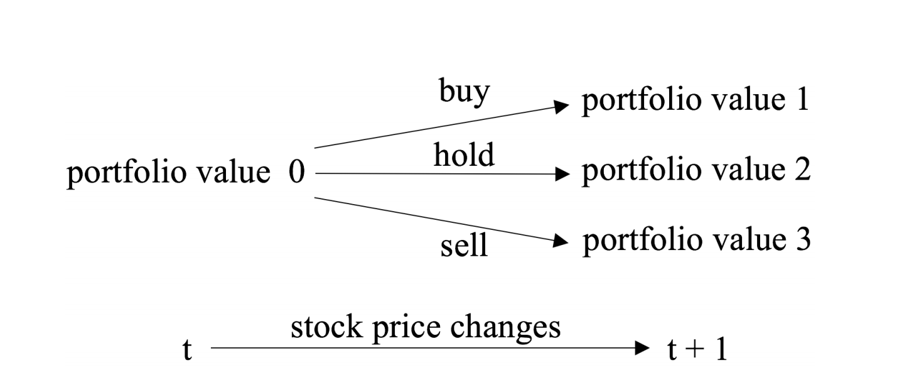
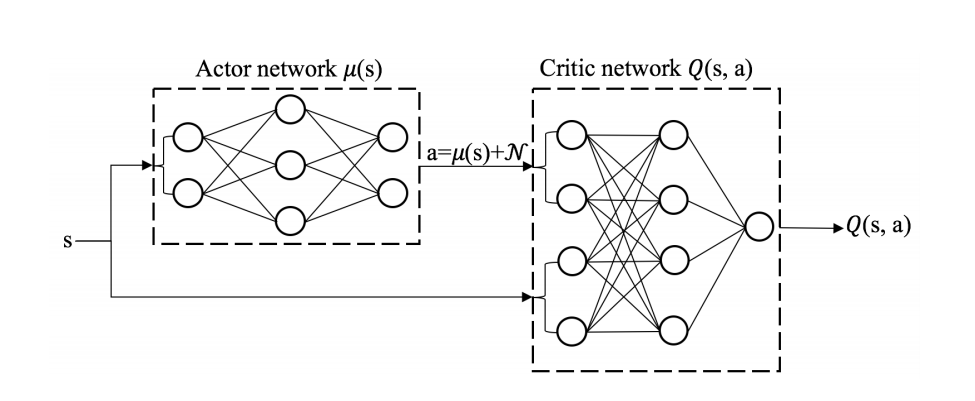
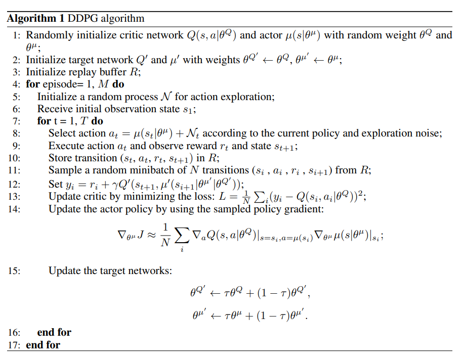
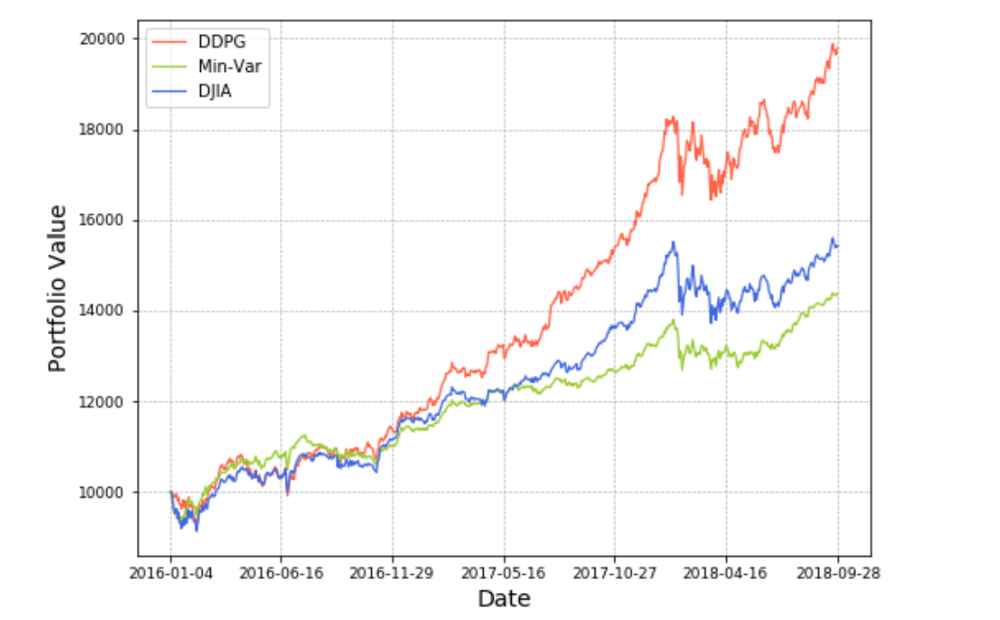
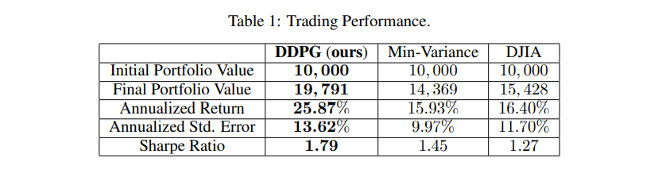

<h1 align = center><b>实践性的基于深度强化学习的量化交易算法</b></h1>
<h2 align = center size="7">摘要</h2>
股票的量化交易策略在投资公司的日常运作中扮演着非常重要的角色。然而，在复杂多变的股票市场中始终保持最优的交易策略是非常具有挑战性的。我们探索了用深度强化学习来优化股票交易策略并最大化投资回报的潜力。30支股票被我们选择为了我们的交易股票，它们的每日的价格被用作为了训练数据和交易市场环境。我们训练了一个深度强化学习的智能体（agent）并获得了一个适应性的交易策略。智能体的表现与基于道琼斯工业股票平均价格指数（Dow Jones Industrial Average, DJIA）的交易策略和传统的最小方差投资组合分配策略（min-variance portfolio allocation strategy）来比较和评价。提出的深度强化学习的方法在夏普比率（Sharpe Ratio）和累计回报比两个基准方法表现的更好。

## 1. 介绍

能够赚钱的股票投资策略对于投资公司来说非常重要。它被应用于优化资本的分配进而最大化投资表现，比如预期回报。使回报最大化取决于对股票的潜在回报及风险的估计。然而，在复杂的股票市场中把所有的相关因素都考虑到是件非常有挑战性的事情。

一个传统的做法就是在[第四篇参考文献](http://www.finance.martinsewell.com/capm/Markowitz1952.pdf)中提到的分两步进行的。首先，股票的预期回报和股票价格的协方矩阵被计算了出来。最佳的投资组合分配策略是通过或者最大化固定风险投资组合的回报或者最小化一定量投资回报的风险。然后，最好的交易策略就来源于遵循最佳的投资组合分配策略。然而，如果经理想要在每个时间节点修改决策，比如将交易费用考虑进去的话，这个方法可能执行起来很复杂。另一种解决股票交易问题的方式则是将它用马尔科夫决策过程（Markov Decision Process，MDP）模型化然后用动态规划（Dynamic Programming）的方法来求解出最佳的策略。然而，在处理股票市场时由于状态空间很大所以这个模型的可扩展性很差。

由上述的挑战启发，我们探索了一个被叫做[Deep Deterministic Policy Gradient](https://arxiv.org/pdf/1509.02971) (DDPG)的深度强化学习算法来在复杂多变的股票市场中找到最佳的交易策略。这个算法由三个关键部分组成：(i) [Actor-Critic框架]([Actor-Critic Algorithms (nips.cc)](https://papers.nips.cc/paper/1999/file/6449f44a102fde848669bdd9eb6b76fa-Paper.pdf))来给较大的状态空间与行动空间建模；(ii) 使训练过程稳定的[目标网络（target network）]([Human-level control through deep reinforcement learning | Nature](https://www.nature.com/articles/nature14236)); (iii)能够去除样本间相关性并增强数据使用的经验回放（Experience Replay）方法。DDPG算法的高效性表现在比传统的最小方差投资组合分配策略（min-variance portfolio allocation strategy）和基于道琼斯工业股票平均价格指数（Dow Jones Industrial Average, DJIA）的交易策略达成更高的收益

这篇沦为由如下部分组成。第二部分包含了我们股票交易问题的陈述。在第三部分，我们具体陈述了主要的DDPG算法。在第四部分介绍我们的数据预处理和实验性的设定并且展示DDPG算法的表现。第五部分将给出结论。

## 2.  问题陈述

我们将股票交易的过程建模为一个马尔科夫决策过程（Markov Decision Process，MDP）。我们紧接着将我们的训练目标转化为一个求解函数最大值的问题。

#### 2.1 函数化股票交易过程

考虑到交易市场的随机性和交互性，我们将股票交易的过程建立一个如公式（1）所示的马尔科夫决策过程（Markov Decision Process，MDP）模型：

$$ Q_{\pi }\left ( s_{t},a_{t} \right )=\mathbb{E}_{s_{t+1}}\left [ r\left (   s_{t},a_{t},s_{t+1}\right ) +\gamma \mathbb{E}_{a_{t+1}\sim \pi \left ( a_{t+1} \right )}\left [ Q_{\pi }\left ( s_{t+1},a_{t+1} \right ) \right ] \right ] \tag{1}$$ 

其中的参数有如下的定义：

* **状态** $s= \left[\rho,h,b\right]$：一个包含股票价格的集合 $\rho \in \mathbb{R}^{D}_{+}$， 持有股票的数量 $h \in \mathbb{Z}^{D}_{+}$ 和剩余的金额 $b \in \mathbb{R}_{+}$。D是我们考虑市场中的股票数， $\mathbb{Z}_{+}$ 表示非负的整数。
* **操作** a：一个对于**所有股票D**的操作的集合。对每只股票可能的操作有卖出、买入和持有。它们相应的会使**持有h**减少、增加和不变。
* **奖励 $r= \left[s,a,{s}'\right]$**：当**操作a**在**s状态**进行时股票组合的价值的改变，并到达**s′状态**。股票组合的价值等于所有持有股票的价值$p^{T}h$和余额b的和。
* **策略** π(s)：在s状态下的交易策略。它本质上是**s状态**时**操作a**的概率分布。
* **操作价值评估函数** $Q_{\pi }\left ( s,a \right )$：遵循策略π在s状态下操作a得到的预期收益

 

股票市场的动态变化可以作如下表示。我们用下标来表示**时间t**那么在一只股票d上可能的操作有：

* **卖出**：k（$k\in \left [ 1,h\left [ d \right ] \right ]$0 且 $d=1,\cdots ,D$）是当前持有可以卖出的份数，k必须是整数，这样操作后 $h_{t+1}=h_{t}-k$ 。
* **持有**：k=0 因此 $h_{t}$ 都不变。
* **买入**：k份能够被买入，买入后 $h_{t+1}=h_{t}+k$ 。因此，$a_{t}\left [ d \right ]=-k$ 是一个整数。

值得注意的是买入的股票不应当对整体的持有股票价值造成负面的影响。也就是说，在保证一般性的情况下，我们假设卖出请求在第一支 $d_{1}$ 股票上，买入请求在最后一支 $d_{2}$ 股票上。这样的话，$a_{t}$应该满足：$p_{t}\left [ 1:d_{1} \right ]^{T}a^{t}\left [ 1:d_{1} \right ]+b_{t}+p_{t}\left [ D-d_{2} : D\right ]^{T}a_{t}\left [ D-d_{2}:D\right ] \geq 0$

余额可以被更新为：$b_{t+1}=b_{t}+p_{t}^{T}a_{t}$

Fig.1解释了这个过程。就如上面所定义的那样，股票组合的价值由余额和所有持有股票的价值构成。在 $t$ 时刻随，一个操作被作出。依照已经作出的操作和股票价格的更新，资产组合价值（portfolio values）从“原始股票组合的价值0（ portfolio value 0）”变到“股票组合的价值1（ portfolio value 1）”，“股票组合的价值2（ portfolio value 2）”，“股票组合的价值3（ portfolio value 3）”

在进行市场交易之前，$p_{0}$ 是0时刻的股票价格，$b_{0}$ 是初始时刻用于交易的金额。$h$ 和 $Q_{π}(s,a)$ 的值被初始化为0. $π(s)$是在任一状态下所有操作概率的均匀分布。接着 $Q_{π}(s_{t},a_{t})$ 通过不断与外界交互来学习

Figure 1:一个开始的股票组合的价值和3个操作导致了三个可能的股票组合价值，操作可能性的和为1。值得注意的是如果股票价格变动的话，“持有”操作可能导致不同的股票组合价值

根据贝尔曼方程（Bellman Equation），操作 $a_{t}$ 的期望奖励由 $r(s_{t},a_{t},s_{t+1})$ 的期望加上下个状态 $s_{t+1}$ 的期望奖励来计算，根据先前的假设，回报将乘上一个折减系数γ：最终得出：

$$ Q_{\pi }\left ( s_{t},a_{t} \right )=\mathbb{E}_{s_{t+1}}\left [ r\left (   s_{t},a_{t},s_{t+1}\right ) +\gamma \mathbb{E}_{a_{t+1}\sim \pi \left ( a_{t+1} \right )}\left [ Q_{\pi }\left ( s_{t+1},a_{t+1} \right ) \right ] \right ] .\tag{1}$$ 

#### 2.2 回报最大的交易目标

这个目标是为了设定在一段时间 $t_{f}$ 后能产生最大回报的交易策略， $t_{f}$ 时刻的股票组合价值为 $p^{T}_{t_{f}}h_{t}+b_{t_{f}}$, 也等于 $\sum_{t=1}^{t_{f}-1}r\left ( s_{t},a_{t},s_{t+1} \right )$ 由于模型的马尔可夫性质（Markov property），问题可以被归根结底简化为优化策略来最大化函数$Q_{π}(s_{t},a_{t}	)$。这个问题很难因为操作价值评估函数对于策略制定者来说是未知的，必须通过与环境交互来学习。因此在这篇论文中，我们采用深度强化模型来解决这个问题。

## 3. 深度强化模型的方法

我们采用了DDPG算法来最大化投资回报。DDPG是确定策略梯度算法（Deterministic Policy Gradient, DPG）的升级版本。DPG算法结合了Q-learning和policy gradient两个框架。与DPG算法想比，DDPG算法选用了神经网络作为函数逼近器（function approximator）。在这里的DDPG算法是为股票量化交易市场的马尔科夫决策（MDP）模型而量身定做的。

Q-learning算法是学习环境的重要方式。Q-learning算法采用贪心操作 $a_{t+1}$ 来最大化 $s_{t+1}$ 状态下的 $Q(s_{t+1},a_{t+1})$，而不是根据使用 $Q(s_{t+1},a_{t+1})$ 的期望来更新 $Q(s_{t},a_{t})$ 。也就是如下式所示：

$ Q_{\pi }\left ( s_{t},a_{t} \right )=\mathbb{E}_{s_{t+1}}\left [ r \left (   s_{t},a_{t},s_{t+1}\right ) +\gamma \max \limits_{a_{t+1}}Q\left ( s_{t+1},a_{t+1} \right ) \right ] . \tag{2}$

有了采用神经网络作为函数逼近器的深度Q学习网络（DQN），各个状态可以用价值函数来进行编码。但是，采用DQN的方法并不适合用来解决这个问题，因为操作空间的数量巨大。由于每只股票可行的交易策略都是离散的集合，考虑到股票的总个数，操作空间的维数会变得非常巨大，最终会导致维数灾难（curse of dimensionality）。因此，采用DDPG算法来将状态空间映射到操作空间（map states to actions）来解决这个问题

如Fig2所示，DDPG算法由一个Actor网络和一个Critic网络组成。Actor网络 $ \mu\left ( s|\theta^{\mu} \right )$ 来将状态空间映射到操作空间，$\theta^{\mu}$ 是Actor网络的参数的集合。Critic网络$Q\left (s,a|\theta^{Q} \right )$ 输出该状态下操作的价值，$\theta^{Q} $是Critic网络的参数的集合。为了探索更好的操作，Actor网络的输出中加入了根据随机过程 $\mathcal{N}$ 采样的噪声。

与DQN算法相似，DDPG算法采用了一个经验回放（experience replay）缓冲器 $R​$ 来存储变化过程（transitions）并更新网络，能够有效的减少经验样本的相关性（correlation between experience samples）。目标网络 $Q'​$ 和 $\mu'​$ 根据分别复制Actor网络和Critic网络而生成，所以它们能够提供持续的时间差分备份。两个网络都是迭代更新的。每次，DDPG智能体（agent）在状态 $s_{t}​$ 上采取操作 $a_{t}​$ ，然后收到根据 $s_{t+1}​$ 状态确定的回报。变化过程（transitions） $(s_{t},a_{t},s_{t+1},r_{t})​$ 随后被存储到回放缓存器R中。$N​$ 个采样转化过程从R中提取出来， $y_{i} = r_{i}+\gamma Q'\left ( s_{i+1},\mu'\left ( s_{i+1}|\theta ^{\mu'},\theta ^{Q'} \right ) \right ),i = 1,\cdots ,N​$ 被计算出来。Critic网络接着由最小化目标Critic网络 $Q'​$ 和Critic网络 $Q​$ 期望误差 $L(\theta^{Q})​$ 来更新，例如：

$$ L(\theta^{Q}) = \mathbb{E}_{s_{t},a_{t},r_{t},s_{t+1}\sim\mathrm{buffer}}\left [ \left ( r_{t}+\gamma Q'\left ( s_{t+1},\mu\left ( s_{t+1}|\theta^{\mu} \right )|\theta ^{Q'} \right )-Q\left ( s_{t},a_{t}|\theta ^{Q} \right ) \right )^{2} \right ].\tag{3} $$

 Actor网络的参数 $\theta^{\mu}$ 将进行如下操作：

$$\begin{align} \nabla_{\theta^{\mu}}J &\approx\mathbb{E}_{s_{t},a_{t},r_{t},s_{t+1}\sim\mathrm{buffer}}\left [ \nabla_{\theta^{\mu}} Q\left ( s_{t},\mu\left ( s_{t}|\theta^{\mu} \right )|\theta ^{Q} \right ) \right ] . \tag{4} \\&=\mathbb{E}_{s_{t},a_{t},r_{t},s_{t+1}\sim\mathrm{buffer}}\left [ \nabla_{a} Q\left ( s_{t},\mu\left ( s_{t} \right )|\theta ^{Q} \right ) \nabla_{\theta^{\mu}} \mu(s_{t}|\theta^{\mu})\right ]. \tag{5} \end{align}$$

在Critic网络和Actor网络被来自经验缓冲器（experience buffer）的变化过程（transitions）更新之后，目标Actor网络和目标Critic网络将做如下更新：

$$\begin{align}  \theta^{Q'}&\leftarrow \tau \theta^{Q}+\left ( 1-\tau \right ) \theta ^{Q'}, \tag{6} \\ \theta^{\mu'}&\leftarrow \tau \theta^{\mu}+\left ( 1-\tau \right ) \theta ^{\mu'}, \tag{7}\end{align}$$

$\tau$ 是学习率。具体的算法在Algorithm 1中简要描述。

## 4. 表现评估

我们评价Alg.1中DDPG算法的表现。结果显示我们假设的利用DDPG智能体的算法获得的回报比道琼斯工业股票平均价格指数（Dow Jones Industrial Average, DJIA）的交易策略和传统的最小方差投资组合分配策略（min-variance portfolio allocation strategy）获得的收益要高

#### 4.1 数据预处理

我们追踪并选取了2016/1/1的道琼斯30支股票作为我们的交易股票，并用从2009/1/1到2018/9/30的历史每日市值来训练智能体并评价表现。数据集从沃顿研究数据服务中心（WEDS）的 Compustat数据库中获取。

我们的实验由三个阶段组成，分别是训练，验证和交易。在交易阶段，Alg.1中的算法生成一个训练良好的交易智能体。在紧接着的验证阶段调整学习率、迭代次数等重要参数。最后在交易阶段，我们评估拟定方案的收益能力。整个数据集因此被分成了三段，如Fig.3所示.2009年1月1日到2014年12月31日的数据被用来训练。2015年1月1日到2016年1月1日的数据被用来验证。我们在训练数据和验证数据上都训练模型来充分理用可用的数据。最后，我们在2016年1月1日到2018年9月30日的交易数据上测试我们智能体的表现。为了更好的理用交易数据，我们继续训练我们的智能体。这样在交易阶段，智能体也能更好的适应市场的动态环境。

#### 4.2 实验性的设定与股票交易的结果

我们用30只的每日股价的向量来搭建环境，并让DDPG智能体在该环境中训练。为了更新学习率和迭代次数，智能体在验证数据上做验证。最后，我们在交易数据上运行我们的智能体，并将他们的结果和道琼斯工业股票平均价格指数（Dow Jones Industrial Average, DJIA）的交易策略和传统的最小方差投资组合分配策略（min-variance portfolio allocation strategy）进行对比。

四个指标来衡量我们的结果：最终股票组合价值、年度回报、年度标准差和夏普比率（Sharpe Ratio）。最终股票组合价值反映了交易结束阶段的股票组合价值。年度回报显示了股票组合每年的直接收益。年度标准差显示了我们模型的鲁棒性。夏普比率（Sharpe Ratio）则综合考量评估风险与回报。

在Fig. 4中，我们可以看出DDPG策略明显比另外两种策略表现得更好。从Table. 1中可以看出， DDPG策略的年度回报为22.24%，比琼斯工业股票平均价格指数（Dow Jones Industrial Average, DJIA）策略的16.40%和最小方差投资组合分配策略（min-variance portfolio allocation strategy）的15.93%都要高。DDPG策略的夏普比率（Sharpe Ratio）比另外两者都要高，也就是说DDPG策略比另外两者在综合考虑风险与回报后更加有优势。因此，结果表明，先前假设的DDPG策略能有效地比基准琼斯工业股票平均价格指数（Dow Jones Industrial Average, DJIA）策略和最小方差投资组合分配策略（min-variance portfolio allocation strategy）都要出色。

## 结论

在这篇论文中，我们探索了DDPG策略学习股票交易策略的潜力。结果表明我们训练的DDPG智能体比其他两者的累计回报更高。夏普比率（Sharpe Ratio）的对比表明我们的策略比另外两种在考虑风险和回报时有更强的鲁棒性。

将来的工作将着重于探索更加先进的模型，处理更大量的数据，观察智能体的行为，并合并预测方案。

## 参考文献

[1] Stelios D. Bekiros, “Fuzzy adaptive decision-making for boundedly rational traders in speculative stock
markets,” European Journal of Operational Research, vol. 202, pp. 285-293, 2010.
[2] Yong Zhang, and Xingyu Yang, “Online portfolio selection strategy based on combining experts’ advice,”
Computational Economics, vol. 50, No. 1, pp. 141-159, 2017.
[3] Youngmin Kim, Wonbin Ahn, Kyong Joo Oh, and David Enke, “An intelligent hybrid trading system for
discovering trading rules for the futures market using rough sets and genetic algorithms,” Applied Soft
Computing, vol. 55, pp. 127-140, 2017.
[4] Markowitzz, H., “Portfolio selection,” The Journal of Finance, vol. 7, No. 1, pp. 77-91, 1952.
[5] Dimitri Bertsekas, “Dynamic programming and optimal control,” Athena Scientific, vol. 1, 1995.
[6] Francesco Bertoluzzoa, and Marco Corazza, “Testing different reinforcement learning configurations for
financial trading: introduction and applications,” Procedia Economics and Finance, vol. 3, pp. 68-77, 2012.
[7] Ralph Neuneier, “Optimum asset allocation using adaptive dynamic programming,” Advances in Neural
Information Processing Systems, vol. 8, 1996.
[8] Ralph Neuneier, “Enhancing Q-Learning for optimal asset allocation,” Advances in Neural Information
Processing Systems, 1997.
[9] Timothy P. Lillicrap, Jonathan J. Hunt, Alexander Pritzel, Nicolas Heess, Tom Erez, Yuval Tassa,
David Silver, and Daan Wierstra, “Continuous control with deep reinforcement learning,” arXiv preprint
arXiv:1509.02971, 2015.
[10] Vijay R. Konda and John Tsitsiklis. “Actor-critic algorithms,” Advances in Neural Information Processing
Systems, pp. 1008–1014, 1999.
[11] Volodymyr Mnih, et al, “Human-level control through deep reinforcement learning,” Nature, pp. 529-533,
2015.
[12] David Silver, Guy Lever, Nicolas Heess, Thomas Degris, Daan Wierstra, Martin Riedmiller, “Deterministic
policy gradient algorithms,” International Conference on Machine Learning, vol. 32, 2014.
[13] Richard S. Sutton and Andrew G. Barto, Reinforcement learning: an introduction, MIT Press. 1998.
[14] Richard S. Sutton, et al. “Policy gradient methods for reinforcement learning with function approximation,”
Advances in Neural Information Processing Systems, 2000.
[15] Lucian Bu¸soniu, Tim de Bruin, Domagoj Tolic, Jens Kober, Ivana Palunko, “Reinforcement learning for ´
control: Performance, stability, and deep approximators,” Annual Reviews in Control, ISSN 1367-5788,
2018.
[16] “Codes for Min-Variance Portfolio Allocation,” http://www.tensorlet.com/.
[17] Hongyang Yang, Xiao-Yang Liu, Qingwei Wu, “A practical machine learning approach for dynamic stock
recommendation,” IEEE International Conference On Trust, Security and Privacy in Computing And
Communications, 2018.
[18] Compustat Industrial [daily Data]. Available: Standard Poor’s/Compustat [2017]. Retrieved from “Wharton
Research Data Service,” 2015.
[19] Willia F. Sharpe, “The Sharpe ratio,” The Journal of Portfolio Management, vol. 1, No. 1, 21, 49-58, 1994.
[20] Lu Wang, Wei Zhang, Xiaofeng He, Hongyuan Zha, “Supervised reinforcement learning with recurrent neural Network for dynamic treatment recommendation,” International Conference on Knowledge Discovery
& Data Mining, pp. 2447-2456, 2018.
[21] Yuri Burda, Harri Edwards, Deepak Pathak, Amos Storkey, Trevor Darrell, Alexei A. Efros, “Large-scale
study of curiosity-driven learning,” arXiv:1808.04355, 2018.
[22] Xiao-Yang Liu, Zihan Ding, Sem Borst, Anwar Walid, “Deep reinforcement learning for intelligent
transportation systems," NeurIPS Workshop on Machine Learning for Intelligent Transportation Systems,
2018.
[23] Weiju Lu, Xiao-Yang Liu, Qingwei Wu, Yue Sun, Anwar Walid, “Transform-based multilinear dynamical
system for tensor time series analysis," NeurIPS Workshop on Modeling and Decision-Making in the
Spatiotemporal Domain, 2018.